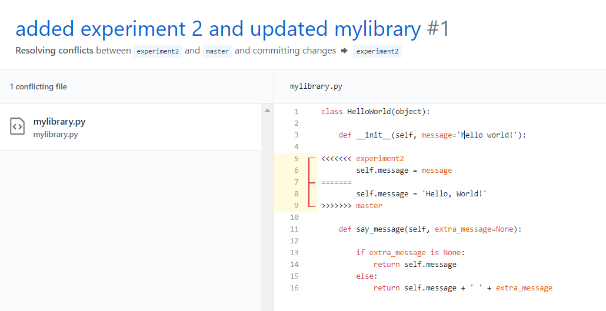

# Version Control demo

This demo will walk you through the basics of using `git` and the GitHub platform. It assumes that you already have `git` [installed](https://git-scm.com/) and that you have [ssh access to GitHub](https://help.github.com/en/articles/generating-a-new-ssh-key-and-adding-it-to-the-ssh-agent) setup.

## Cloning the repository

First we will clone the newly created repository. If you navigate to the GitHub repository page, [`https://github.com/dlej/d2k-git-demo`](https://github.com/dlej/d2k-git-demo), you will find a button to clone:


Then in a terminal, we can clone the repository using this address `git clone`, and we will have a copy of the repository with  the files `LICENSE` and `README.md` on our local machine.


```
$ git clone git@github.com:dlej/d2k-git-demo.git
Cloning into 'd2k-git-demo'...
Warning: Permanently added the RSA host key for IP address '140.82.113.4' to the list of known hosts.
remote: Enumerating objects: 4, done.
remote: Counting objects: 100% (4/4), done.
remote: Compressing objects: 100% (4/4), done.
remote: Total 4 (delta 0), reused 0 (delta 0), pack-reused 0
Receiving objects: 100% (4/4), done.
Checking connectivity... done.

$ ls
d2k-git-demo/

$ cd d2k-git-demo/

$ ls
LICENSE  README.md
```

## Pushing code to GitHub

Let's suppose we create two new files called `mylibrary.py` (view [here](https://github.com/dlej/d2k-git-demo/blob/eeeb7f94c15227406f5572a8f9070890f2cc5d7e/mylibrary.py)) and `experiment1.py` (view [here](https://github.com/dlej/d2k-git-demo/blob/eeeb7f94c15227406f5572a8f9070890f2cc5d7e/experiment1.py)) that allow us to run an experiment. Our experiment gives the following output:

```
$ python experiment1.py
hello world! how are you?
```

Since our experiment works as we expect, we'd like to add the new code to GitHub. To do this, we first commit our changes to the local repository, then push what we have committed to the local repository to the remote repository at `github.com`. To commit changes, we first stage the files that we would like to commit using `git add`:

```
$ git add mylibrary.py experiment1.py

$ git status
On branch master
Your branch is up-to-date with 'origin/master'.
Changes to be committed:
  (use "git reset HEAD <file>..." to unstage)

        new file:   experiment1.py
        new file:   mylibrary.py

Untracked files:
  (use "git add <file>..." to include in what will be committed)

        __pycache__/

```

Once we have all of our changes staged, we create our commit with `git commit`, providing along with the commit a message indicating the nature of the change:

```
$ git commit -m "hello world experiment"
[master eeeb7f9] hello world experiment
 2 files changed, 17 insertions(+)
 create mode 100644 experiment1.py
 create mode 100644 mylibrary.py
```

Every commit has a checksum that can be used to identify the commit. For this commit, the `eeeb7f9` are the first 7 digits of the checksum. Once we have created our local commit, we can push our changes to GitHub:

```
$ git push
Warning: Permanently added the RSA host key for IP address '140.82.114.4' to the list of known hosts.
Counting objects: 4, done.
Delta compression using up to 4 threads.
Compressing objects: 100% (4/4), done.
Writing objects: 100% (4/4), 583 bytes | 0 bytes/s, done.
Total 4 (delta 0), reused 0 (delta 0)
To git@github.com:dlej/d2k-git-demo.git
   1c715c4..eeeb7f9  master -> master
```

Now our repository at `github.com` contains the same code as checked in to commit `eeeb7f9` on our local machine.

## Branching and merging

A good practice, especially when you have multiple collaborators working on a code base simultaneously, is to do work locally on new branches rather than the `master` branch. This makes it much easier to resolve conflicts when the same file is being edited by multiple people at once.

### Branching

Suppose that Alice decides that she wants to write a new experiment. She can create a new branch starting from the current commit on master using `git checkout -b`:

```
$ git checkout -b experiment2
Switched to a new branch 'experiment2'
```

This branch only exists on Alice's local machine, however, so she has create the branch on the remote repository.

```
$ git push origin experiment2
Total 0 (delta 0), reused 0 (delta 0)
remote:
remote: Create a pull request for 'experiment2' on GitHub by visiting:
remote:      https://github.com/dlej/d2k-git-demo/pull/new/experiment2
remote:
To git@github.com:dlej/d2k-git-demo.git
 * [new branch]      experiment2 -> experiment2
```

At the same time, Bob comes a long to the repository and thinks it needs some tidying up, so he also creates a new branch to work:

```
$ git checkout -b tidying
Switched to a new branch 'tidying'

$ git push origin tidying
Total 0 (delta 0), reused 0 (delta 0)
remote:
remote: Create a pull request for 'tidying' on GitHub by visiting:
remote:      https://github.com/dlej/d2k-git-demo/pull/new/tidying
remote:
To git@github.com:dlej/d2k-git-demo.git
 * [new branch]      tidying -> tidying
```

### Merging

#### Command-line

Suppose that Bob finishes his changes first. He has made some tweaks to `mylibrary.py` and added `.gitignore` (view [here](https://github.com/dlej/d2k-git-demo/blob/3f9037e3097624a7ab1649d20e8a2e9fd681459e/.gitignore)) so that the `__pycache__` directory is ignored by `git`. He can view his changes to existing files such as `mylibrary.py` using `git diff`:

```
$ git diff
diff --git a/mylibrary.py b/mylibrary.py
index bc39ba8..bc94bd1 100644
--- a/mylibrary.py
+++ b/mylibrary.py
@@ -2,9 +2,9 @@ class HelloWorld(object):

     def __init__(self):

-        self.message = 'hello world!'
+        self.message = 'Hello, World!'

-    def say(self, extra_message=None):
+    def say_message(self, extra_message=None):

         if extra_message is None:
             return self.message
```

Bob then commits his changes:

```
$ git add .gitignore mylibrary.py

$ git status
On branch tidying
Changes to be committed:
  (use "git reset HEAD <file>..." to unstage)

        new file:   .gitignore
        modified:   mylibrary.py


$ git commit -m "Added .gitignore and fixed grammar."
[tidying 3f9037e] Added .gitignore and fixed grammar.
 2 files changed, 3 insertions(+), 2 deletions(-)
 create mode 100644 .gitignore
```

He then pushes the changes to the remote `tidying` branch created before. However, he has not pushed to this branch before, so he has to additionally provide the arguments `-u origin tidying` to set the destination of the push for this branch:

```
$ git push -u origin tidying
Counting objects: 4, done.
Delta compression using up to 4 threads.
Compressing objects: 100% (3/3), done.
Writing objects: 100% (4/4), 398 bytes | 0 bytes/s, done.
Total 4 (delta 2), reused 0 (delta 0)
remote: Resolving deltas: 100% (2/2), completed with 2 local objects.
To git@github.com:dlej/d2k-git-demo.git
   eeeb7f9..3f9037e  tidying -> tidying
Branch tidying set up to track remote branch tidying from origin.
```

Now it is time for him to merge his changes into the `master` branch using. First he will merge any changes on the master branch into the `tidying` branch using `git merge`, then merge the `tidying` branch into `master`. This way, if there are any conflicts in merging, he can resolve them on the working branch. Finally, he will push the new changes to the remote `master` branch.

```
$ git merge master
Already up-to-date.

$ git checkout master
Switched to branch 'master'
Your branch is up-to-date with 'origin/master'.

$ git merge tidying
Updating eeeb7f9..3f9037e
Fast-forward
 .gitignore   | 1 +
 mylibrary.py | 4 ++--
 2 files changed, 3 insertions(+), 2 deletions(-)
 create mode 100644 .gitignore

$ git push
Total 0 (delta 0), reused 0 (delta 0)
To git@github.com:dlej/d2k-git-demo.git
   eeeb7f9..3f9037e  master -> master
```

#### Pull requests

Alice has finally finished her work, which consists of some tweaks to `mylibrary.py` and a new `experiment2.py` (view [here](https://github.com/dlej/d2k-git-demo/blob/f924cef164cb02a9a9e3942a293aadcba6e3945c/experiment2.py)). The new experiment generates some Fibonacci numbers:

```
$ python experiment2.py
1 1 2 3 5 8 13 21 34 55
```

Alice did not end up needing the changes she made to `mylibrary.py`, but she will commit them anyway.

```
$ git add experiment2.py mylibrary.py

$ git status
On branch experiment2
Changes to be committed:
  (use "git reset HEAD <file>..." to unstage)

        new file:   experiment2.py
        modified:   mylibrary.py

Untracked files:
  (use "git add <file>..." to include in what will be committed)

        __pycache__/


$ git commit -m "added experiment 2 and updated mylibrary"
[experiment2 f924cef] added experiment 2 and updated mylibrary
 2 files changed, 11 insertions(+), 2 deletions(-)
 create mode 100644 experiment2.py

$ git push -u origin experiment2
Counting objects: 4, done.
Delta compression using up to 4 threads.
Compressing objects: 100% (4/4), done.
Writing objects: 100% (4/4), 539 bytes | 0 bytes/s, done.
Total 4 (delta 1), reused 0 (delta 0)
remote: Resolving deltas: 100% (1/1), completed with 1 local object.
To git@github.com:dlej/d2k-git-demo.git
   eeeb7f9..f924cef  experiment2 -> experiment2
Branch experiment2 set up to track remote branch experiment2 from origin.
```

Now that she has pushed her commit to the remote branch, she can create a pull requeston GitHub, which is a request to merge her branch into the `master` branch.


However, because both Alice and Bob edited the same part of `mylibrary.py`, git is unable to automatically merge the two commits. So, Alice can resolve the merge conflict manually.


Alice will use the online editor to perform the conflict resolution:



There she sees that Bob's change was to fix the capitalization and punctuation of `'hello world!'`. She resolves the conflict by keeping `self.message = message` from her branch but updating the default parameter setting to `message='Hello, World!'` like Bob wanted.


Then she can mark the conflict as resolved and commit the changes. Lastly, she can merge the pull request to bring the changes into the `master` branch.


To get the changes locally, Alice will have to update her local copy of the `master` branch with `git pull`:

```
$ git checkout master
Switched to branch 'master'
Your branch is behind 'origin/master' by 3 commits, and can be fast-forwarded.
  (use "git pull" to update your local branch)

$ git pull
Updating 3f9037e..1fb3f83
Fast-forward
 experiment2.py | 9 +++++++++
 mylibrary.py   | 4 ++--
 2 files changed, 11 insertions(+), 2 deletions(-)
 create mode 100644 experiment2.py
```

## Reproducing experiments

Alice now wants to go back and run `experiment1.py` again, so she tries to run it. 

```
danie@BANGNOLUFSEN MINGW64 /c/src/rice/d2k/d2k-git-demo (master)
$ python experiment1.py
Traceback (most recent call last):
  File "experiment1.py", line 5, in <module>
    print(helloworld.say('how are you?'))
AttributeError: 'HelloWorld' object has no attribute 'say'
```

Oh no! Something went wrong. Turns out, when Bob made his changes, he changed something in `mylibrary.py` that broke `experiment1.py`. But Alice can still run this experiment if she rolls back the code base to what it was when she created the experiment originally by checking out commit `eeeb7f9`.

```
$ git checkout eeeb7f9
M       README.md
Note: checking out 'eeeb7f9'.

You are in 'detached HEAD' state. You can look around, make experimental
changes and commit them, and you can discard any commits you make in this
state without impacting any branches by performing another checkout.

If you want to create a new branch to retain commits you create, you may
do so (now or later) by using -b with the checkout command again. Example:

  git checkout -b <new-branch-name>

HEAD is now at eeeb7f9... hello world experiment

danie@BANGNOLUFSEN MINGW64 /c/src/rice/d2k/d2k-git-demo ((eeeb7f9...))
$ python experiment1.py
hello world! how are you?
```

This works exactly as it did originally. Alice can return to the normal `master` branch simply by checking out `master`.

```
$ git checkout master
M       README.md
Previous HEAD position was eeeb7f9... hello world experiment
Switched to branch 'master'
Your branch is up-to-date with 'origin/master'.
```